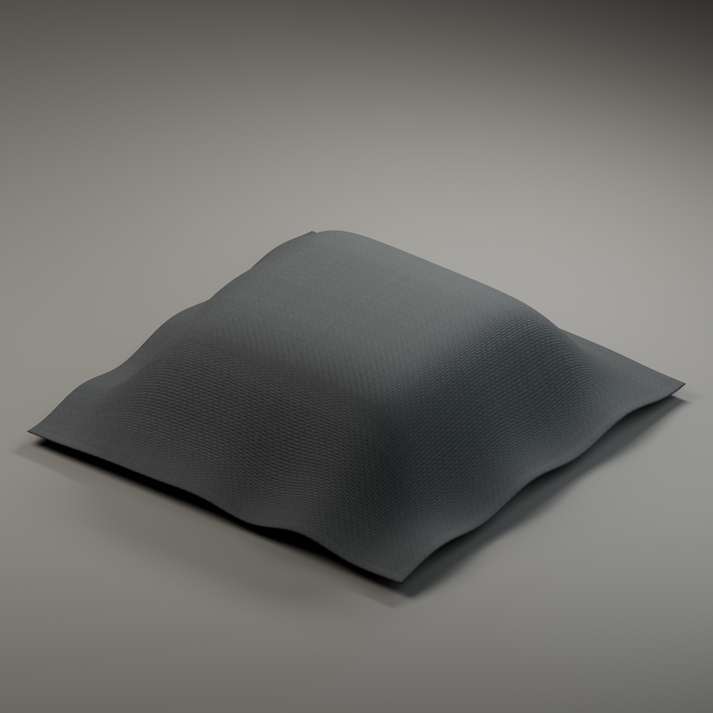
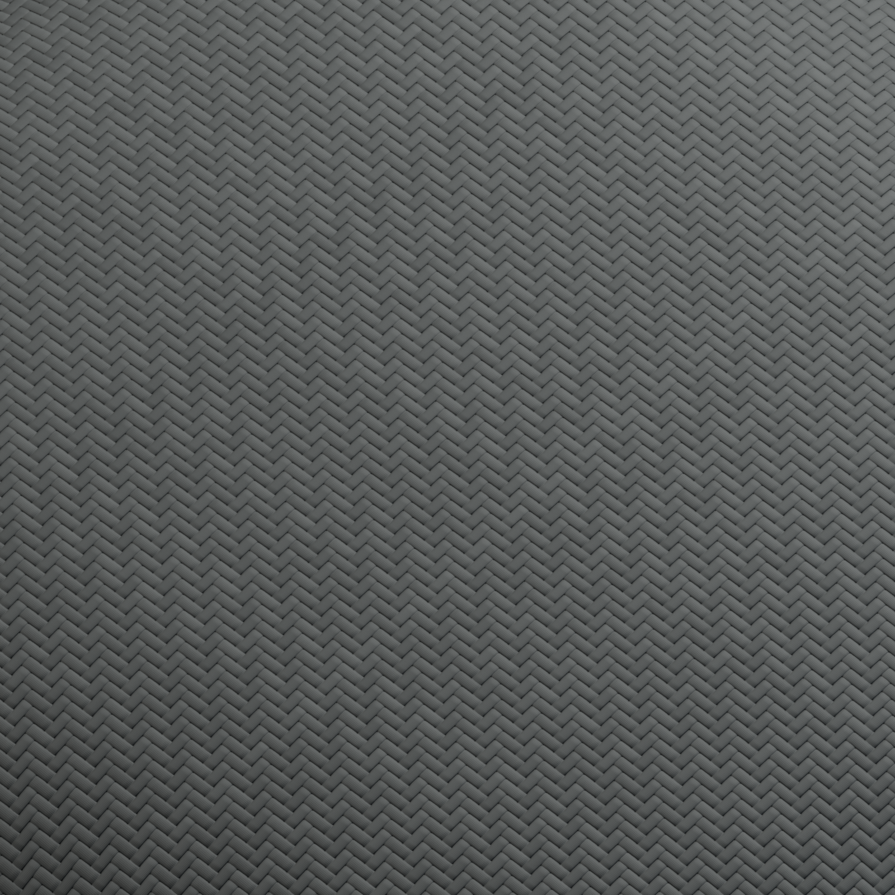
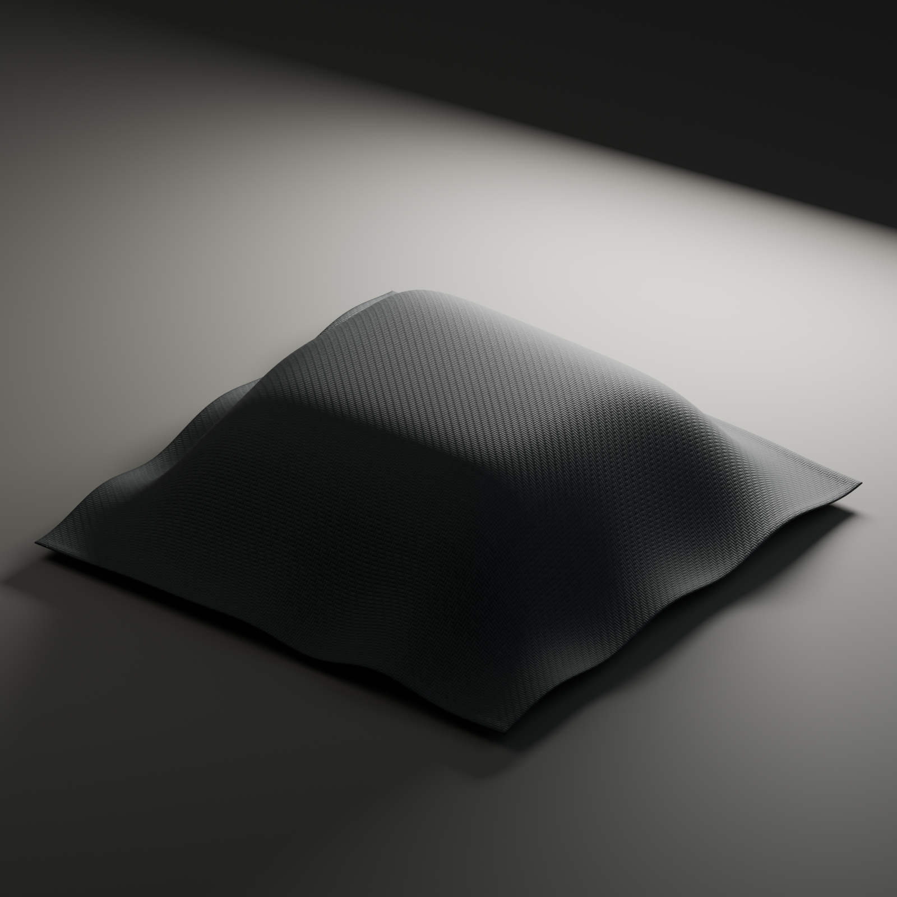

# Graphite Twill 01 — original material study

A portfolio demonstration from 3D Forge, rendered from an original procedural 2/2 twill material in Blender 4.5.13 LTS using Cycles. These are actual material renders, not client work or photographs.

The finish is art-directed. The demonstration uses an analytic folded swatch and tangent-space normal detail; it is not a physical cloth simulation or a measured fabric scan. No third-party textures, photographs, models or HDR environments were used.

This repository contains portfolio images only. It does not accept payments, create an order, or grant a raw-asset resale license.
